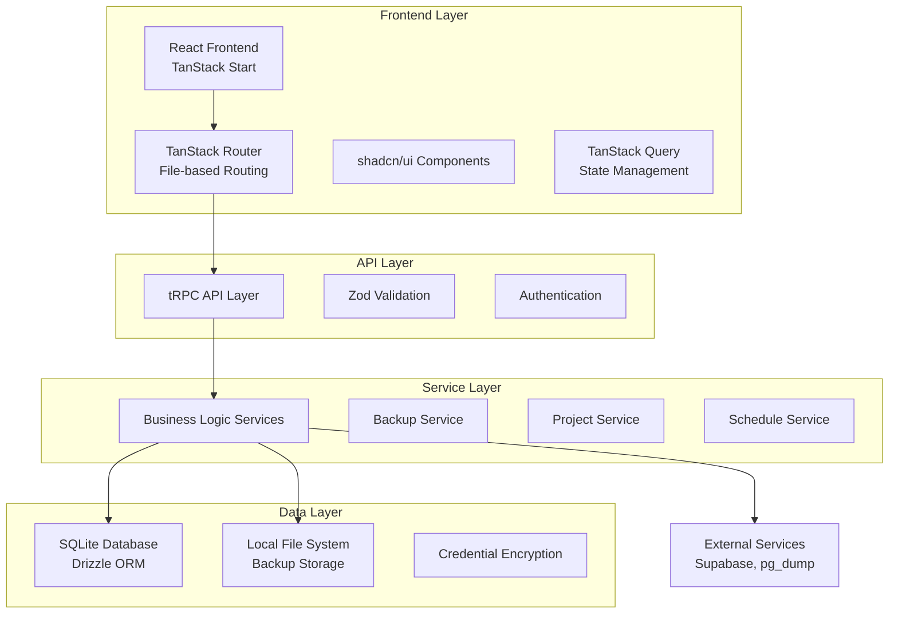
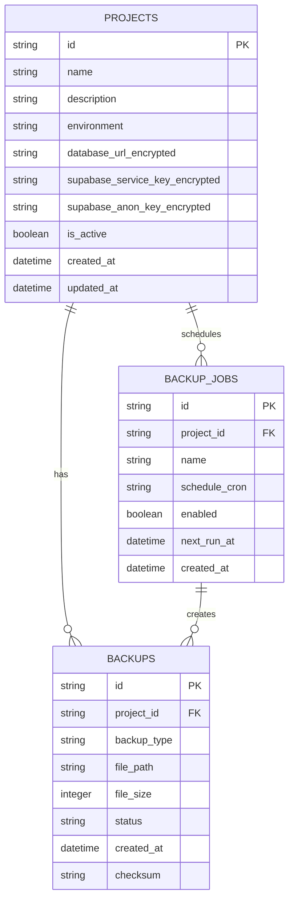

# Architecture Overview

Technical architecture and design patterns for the Supabase Backup Tool.

## 🏗️ System Architecture

### High-Level Overview



## 🔧 Technology Stack

### Frontend Technologies
- **Framework**: TanStack Start (React meta-framework)
- **Routing**: TanStack Router (file-based, type-safe)
- **State Management**: TanStack Query (server state)
- **UI Components**: shadcn/ui + Radix UI primitives
- **Styling**: TailwindCSS v4 with @theme directive
- **Type Safety**: TypeScript with strict configuration

### Backend Technologies
- **API**: tRPC (type-safe API with React Query integration)
- **Database**: SQLite with Drizzle ORM
- **Validation**: Zod schemas for runtime validation
- **Encryption**: Node.js crypto for credential protection
- **File Operations**: Node.js fs/streams for backup handling

### Development Tools
- **Package Manager**: pnpm (fast, efficient)
- **Build Tool**: Vite (fast development and builds)
- **Code Quality**: ESLint + Prettier
- **Version Control**: Git with conventional commits

## 🗄️ Database Architecture

### Schema Design Philosophy

1. **Single Source of Truth**: Drizzle schemas define all data structures
2. **Type Safety**: TypeScript types inferred from schemas
3. **Validation Chain**: Schema → Types → Validation → UI
4. **Encryption**: Sensitive data encrypted at rest

### Entity Relationship Diagram



### Data Flow Patterns

```typescript
// 1. Schema Definition (Primary Source)
export const projects = sqliteTable('projects', {
  id: text('id').primaryKey(),
  name: text('name').notNull(),
  // ... other fields
})

// 2. Inferred Types (Secondary)
export type Project = InferSelectModel<typeof projects>
export type NewProject = InferInsertModel<typeof projects>

// 3. Validation Schemas (Derived)
export const createProjectSchema = createInsertSchema(projects, {
  name: (schema) => schema.min(1).max(100),
})

// 4. API Integration
export const projectsRouter = router({
  create: publicProcedure
    .input(createProjectSchema)
    .mutation(async ({ input }) => {
      return await db.insert(projects).values(input)
    })
})
```

## 🔄 API Architecture

### tRPC Design Patterns

#### Router Organization
```typescript
// src/lib/trpc/routers/index.ts
export const appRouter = router({
  projects: projectsRouter,    // Project management
  backups: backupsRouter,      // Backup operations
  jobs: jobsRouter,            // Scheduled jobs
  analytics: analyticsRouter,  // Metrics and analytics
})
```

#### Procedure Types
- **Query**: Read operations (list, get by ID)
- **Mutation**: Write operations (create, update, delete)
- **Subscription**: Real-time updates (backup progress)

#### Input Validation
```typescript
export const createBackupInput = z.object({
  projectId: z.string().uuid(),
  backupType: z.enum(['full', 'schema', 'data']),
  compressionType: z.enum(['none', 'gzip', 'bzip2']).default('gzip'),
})
```

### Error Handling Strategy

```typescript
// Standardized error responses
export class BackupError extends Error {
  constructor(
    message: string,
    public code: string,
    public statusCode: number = 500
  ) {
    super(message)
    this.name = 'BackupError'
  }
}

// tRPC error handling
export const backupsRouter = router({
  create: publicProcedure
    .input(createBackupInput)
    .mutation(async ({ input }) => {
      try {
        const result = await backupService.createBackup(input)
        return { success: true, data: result }
      } catch (error) {
        if (error instanceof BackupError) {
          throw new TRPCError({
            code: 'BAD_REQUEST',
            message: error.message,
            cause: error,
          })
        }
        throw new TRPCError({
          code: 'INTERNAL_SERVER_ERROR',
          message: 'Backup creation failed',
        })
      }
    })
})
```

## 🎨 Frontend Architecture

### Component Hierarchy

```
App (Root Layout)
├── Providers
│   ├── TRPCProvider (API state)
│   ├── ThemeProvider (Dark/light mode)
│   └── ToastProvider (Notifications)
├── Layout Components
│   ├── AppSidebar (Navigation)
│   ├── NavMain (Primary navigation)
│   └── NavUser (User menu)
└── Page Components
    ├── ProjectsPage
    │   ├── ProjectForm (Reusable form)
    │   ├── ProjectCard (Project display)
    │   └── ProjectList (Collection view)
    ├── BackupsPage
    │   ├── BackupCreateForm
    │   ├── BackupProgress
    │   └── BackupHistory
    └── DashboardPage
        ├── ProjectOverview
        ├── RecentActivity
        └── QuickActions
```

### State Management Patterns

#### Server State (TanStack Query)
```typescript
// Standardized query options
export const useProjects = () => {
  return useQuery(trpc.projects.list.queryOptions())
}

export const useProject = (id: string) => {
  return useQuery(trpc.projects.getById.queryOptions({ id }))
}

// Optimistic updates
export const useCreateProject = () => {
  const queryClient = useQueryClient()
  
  return useMutation(trpc.projects.create.mutationOptions({
    onSuccess: () => {
      queryClient.invalidateQueries(trpc.projects.list.queryFilter())
    }
  }))
}
```

#### Local State (React State)
```typescript
// Form state with controlled components
export function ProjectForm() {
  const [formData, setFormData] = useState<ProjectFormData>({
    name: '',
    description: '',
    environment: 'production',
  })
  
  const handleInputChange = (field: keyof ProjectFormData, value: string) => {
    setFormData(prev => ({ ...prev, [field]: value }))
  }
  
  // ... rest of component
}
```

### Component Design Patterns

#### Composition over Inheritance
```typescript
// Reusable form component with composition
export function ProjectForm({ 
  onSuccess, 
  onCancel, 
  showActions = true 
}: ProjectFormProps) {
  // Form logic here
  
  return (
    <Card>
      <CardHeader>
        <CardTitle>Project Details</CardTitle>
      </CardHeader>
      <CardContent>
        {/* Form fields */}
        {showActions && (
          <div className="flex gap-2">
            <Button onClick={onCancel}>Cancel</Button>
            <Button type="submit">Save</Button>
          </div>
        )}
      </CardContent>
    </Card>
  )
}
```

#### Custom Hooks for Reusability
```typescript
// Custom hook for backup operations
export function useBackupOperations(projectId: string) {
  const createBackup = useMutation(trpc.backups.create.mutationOptions())
  const deleteBackup = useMutation(trpc.backups.delete.mutationOptions())
  
  return {
    createBackup: (options: BackupOptions) => 
      createBackup.mutate({ projectId, ...options }),
    deleteBackup: (backupId: string) => 
      deleteBackup.mutate({ id: backupId }),
    isCreating: createBackup.isPending,
    isDeleting: deleteBackup.isPending,
  }
}
```

## 🔧 Service Layer Architecture

### Service Organization

```typescript
// Base service class
abstract class BaseService {
  protected db: Database
  protected logger: Logger
  
  constructor() {
    this.db = db
    this.logger = new Logger(this.constructor.name)
  }
  
  protected async handleError(error: unknown, operation: string): Promise<never> {
    this.logger.error(`${operation} failed:`, error)
    throw error instanceof Error ? error : new Error(`${operation} failed`)
  }
}

// Specific service implementations
export class BackupService extends BaseService {
  async createBackup(projectId: string, options: BackupOptions): Promise<BackupResult> {
    try {
      this.logger.info(`Creating backup for project ${projectId}`)
      // Implementation here
    } catch (error) {
      await this.handleError(error, 'Backup creation')
    }
  }
}
```

### Background Job Processing

```typescript
// Job queue interface
export interface JobQueue {
  add<T>(jobType: string, data: T, options?: JobOptions): Promise<Job>
  process<T>(jobType: string, processor: JobProcessor<T>): void
  getJob(jobId: string): Promise<Job | null>
}

// Backup job processor
export class BackupJobProcessor {
  constructor(
    private backupService: BackupService,
    private jobQueue: JobQueue
  ) {}
  
  async processBackupJob(job: Job<BackupJobData>): Promise<void> {
    const { projectId, options } = job.data
    
    try {
      await this.backupService.createBackup(projectId, options)
      await job.progress(100)
    } catch (error) {
      await job.failed(error)
      throw error
    }
  }
}
```

## 🔐 Security Architecture

### Credential Encryption

```typescript
// Encryption service for sensitive data
export class EncryptionService {
  private readonly algorithm = 'aes-256-gcm'
  private readonly keyLength = 32
  
  async encrypt(text: string, key: Buffer): Promise<EncryptedData> {
    const iv = crypto.randomBytes(16)
    const cipher = crypto.createCipher(this.algorithm, key)
    
    let encrypted = cipher.update(text, 'utf8', 'hex')
    encrypted += cipher.final('hex')
    
    const authTag = cipher.getAuthTag()
    
    return {
      encrypted,
      iv: iv.toString('hex'),
      authTag: authTag.toString('hex'),
    }
  }
  
  async decrypt(encryptedData: EncryptedData, key: Buffer): Promise<string> {
    const decipher = crypto.createDecipher(this.algorithm, key)
    decipher.setAuthTag(Buffer.from(encryptedData.authTag, 'hex'))
    
    let decrypted = decipher.update(encryptedData.encrypted, 'hex', 'utf8')
    decrypted += decipher.final('utf8')
    
    return decrypted
  }
}
```

### Input Validation

```typescript
// Multi-layer validation
const createProjectInput = z.object({
  name: z.string()
    .min(1, 'Name is required')
    .max(100, 'Name too long')
    .regex(/^[a-zA-Z0-9\s-_]+$/, 'Invalid characters'),
  databaseUrl: z.string()
    .url('Invalid URL format')
    .refine(url => url.includes('supabase'), 'Must be a Supabase URL'),
})

// Runtime validation in tRPC
.input(createProjectInput)
.mutation(async ({ input }) => {
  // Input is automatically validated and typed
})
```

## 🚀 Performance Optimization

### Query Optimization

```typescript
// Efficient database queries with indexes
export const backups = sqliteTable('backups', {
  id: text('id').primaryKey(),
  projectId: text('project_id').notNull(),
  status: text('status').notNull(),
  createdAt: integer('created_at', { mode: 'timestamp' }).notNull(),
}, (table) => ({
  // Strategic indexes for common queries
  projectIdIdx: index('backups_project_id_idx').on(table.projectId),
  statusIdx: index('backups_status_idx').on(table.status),
  createdAtIdx: index('backups_created_at_idx').on(table.createdAt),
}))
```

### Caching Strategy

```typescript
// TanStack Query caching configuration
export const defaultQueryOptions = {
  staleTime: 5 * 60 * 1000, // 5 minutes
  cacheTime: 10 * 60 * 1000, // 10 minutes
  refetchOnWindowFocus: false,
  retry: (failureCount: number, error: any) => {
    return failureCount < 3 && error.status !== 404
  },
}
```

### File System Optimization

```typescript
// Streaming for large files
export class FileService {
  async compressFile(inputPath: string, outputPath: string): Promise<void> {
    const readStream = createReadStream(inputPath)
    const writeStream = createWriteStream(outputPath)
    const gzipStream = createGzip({ level: 6 })
    
    await pipeline(readStream, gzipStream, writeStream)
  }
  
  async calculateChecksum(filePath: string): Promise<string> {
    const hash = crypto.createHash('sha256')
    const stream = createReadStream(filePath)
    
    for await (const chunk of stream) {
      hash.update(chunk)
    }
    
    return hash.digest('hex')
  }
}
```

## 📁 File Organization

### Directory Structure Rationale

```
src/
├── components/           # UI components only
│   ├── ui/              # shadcn/ui primitives
│   └── *.components.tsx # Domain-specific components
├── lib/                 # Core business logic
│   ├── db/              # Database schemas and types
│   ├── services/        # Business logic services
│   ├── trpc/            # API layer
│   └── utils/           # Utility functions
├── hooks/               # Custom React hooks
├── providers/           # Context providers
└── routes/              # TanStack Router pages
```

### Import Organization

```typescript
// Standardized import order
import { useState, useEffect } from 'react'           // React imports
import { useMutation } from '@tanstack/react-query'   // External libraries
import { Card, CardContent } from '@/components/ui'   // UI components
import { trpc } from '@/lib/trpc'                     // Internal modules
import { type Project } from '@/lib/db'               // Types
```

## 🔮 Future Architecture Considerations

### Scalability Improvements
- **Microservices**: Split backup processing into separate services
- **Message Queues**: Redis/RabbitMQ for job processing
- **Distributed Storage**: Support for cloud storage backends
- **Load Balancing**: Multiple server instances

### Performance Enhancements
- **Database Optimization**: PostgreSQL for production deployments
- **Caching Layer**: Redis for session and query caching
- **CDN Integration**: Static asset distribution
- **Background Processing**: Dedicated worker nodes

### Monitoring & Observability
- **Application Metrics**: Performance and usage tracking
- **Error Tracking**: Centralized error reporting
- **Health Checks**: Service availability monitoring
- **Audit Logging**: Comprehensive operation logging

This architecture provides a solid foundation for current needs while remaining flexible for future enhancements and scaling requirements. 