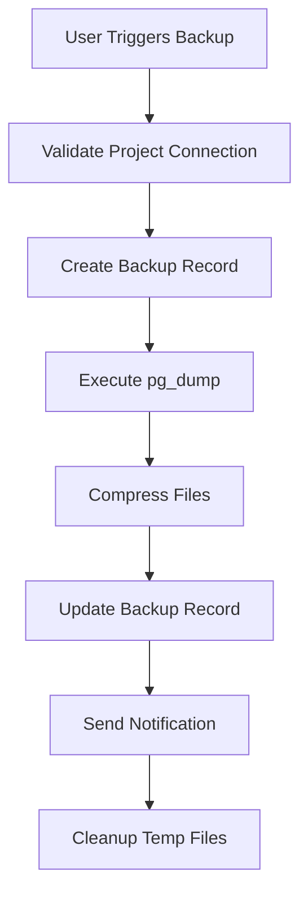

# Next Steps - Development Priorities

Immediate development priorities and implementation roadmap for the Supabase Backup Tool.

## 🎯 Current Status

### ✅ Completed (Phase 1)
- **Project Management System**: Full CRUD operations for Supabase projects
- **UI Components**: Reusable ProjectForm component with password visibility toggles
- **Database Schema**: Projects table with encrypted credential storage
- **Connection Testing**: Validate database URLs and API keys
- **Type Safety**: Complete TypeScript implementation with tRPC
- **Modern UI**: Responsive design with shadcn/ui components

### 🚧 In Progress
- **Documentation**: Comprehensive user and developer documentation
- **Code Organization**: Refactoring forms into reusable components

## 📋 Immediate Priorities (Next 2-4 Weeks)

### Phase 2A: Core Backup Infrastructure

#### 1. Database Schema Extensions
**Priority**: High | **Timeline**: 1 week

```sql
-- Backup records table
CREATE TABLE backups (
  id TEXT PRIMARY KEY,
  project_id TEXT NOT NULL REFERENCES projects(id),
  backup_type TEXT NOT NULL, -- 'full', 'schema', 'data'
  file_path TEXT NOT NULL,
  file_size INTEGER,
  compressed_size INTEGER,
  backup_date DATETIME NOT NULL,
  status TEXT NOT NULL, -- 'pending', 'running', 'completed', 'failed'
  error_message TEXT,
  duration_ms INTEGER,
  created_at DATETIME DEFAULT CURRENT_TIMESTAMP,
  updated_at DATETIME DEFAULT CURRENT_TIMESTAMP
);

-- Backup jobs/scheduling table
CREATE TABLE backup_jobs (
  id TEXT PRIMARY KEY,
  project_id TEXT NOT NULL REFERENCES projects(id),
  name TEXT NOT NULL,
  schedule_cron TEXT NOT NULL,
  backup_type TEXT NOT NULL,
  enabled BOOLEAN DEFAULT true,
  next_run_at DATETIME,
  last_run_at DATETIME,
  last_run_status TEXT,
  created_at DATETIME DEFAULT CURRENT_TIMESTAMP,
  updated_at DATETIME DEFAULT CURRENT_TIMESTAMP
);
```

**Implementation Steps**:
1. Create Drizzle schema files: `backups.schema.ts`, `jobs.schema.ts`
2. Generate and run migrations
3. Create TypeScript types and validation schemas
4. Update tRPC routers for backup operations

#### 2. Backup Service Foundation
**Priority**: High | **Timeline**: 1 week

**Core Service Structure**:
```typescript
// src/lib/services/backup.service.ts
export class BackupService {
  // Database backup operations
  async createDatabaseBackup(projectId: string, options: BackupOptions): Promise<BackupResult>
  async validateBackupIntegrity(backupId: string): Promise<ValidationResult>
  
  // File management
  async organizeBackupFiles(projectId: string): Promise<void>
  async compressBackup(filePath: string): Promise<string>
  
  // Cleanup operations
  async cleanupExpiredBackups(projectId: string): Promise<void>
}
```

**Implementation Requirements**:
- PostgreSQL dump integration using `pg_dump`
- File compression using gzip/bzip2
- Error handling and retry logic
- Progress tracking and logging
- Validation and integrity checks

#### 3. File System Organization
**Priority**: Medium | **Timeline**: 3 days

**Directory Structure**:
```
data/
├── backups/
│   ├── {project-id}/
│   │   ├── database/
│   │   │   ├── full/
│   │   │   ├── schema/
│   │   │   └── data/
│   │   ├── auth/
│   │   ├── storage/
│   │   └── functions/
│   └── temp/
├── logs/
│   ├── backup-operations.log
│   └── error.log
└── config/
    └── backup-settings.json
```

### Phase 2B: Basic Backup Operations

#### 4. Manual Backup UI
**Priority**: High | **Timeline**: 1 week

**Components to Build**:
- `BackupCreateForm`: Manual backup trigger interface
- `BackupProgress`: Real-time backup progress display
- `BackupHistory`: List of previous backups
- `BackupActions`: Download, delete, restore actions

**Features**:
- One-click backup creation
- Real-time progress updates
- Backup type selection (full/schema/data)
- Compression options
- Success/failure notifications

#### 5. Backup Operations Implementation
**Priority**: High | **Timeline**: 2 weeks

**Core Operations**:

1. **Database Backup**:
   ```typescript
   // Full database backup
   async function createFullBackup(project: Project): Promise<Backup> {
     // 1. Generate backup filename with timestamp
     // 2. Execute pg_dump with connection string
     // 3. Compress resulting file
     // 4. Store backup metadata in database
     // 5. Clean up temporary files
   }
   ```

2. **Progress Tracking**:
   - Real-time file size monitoring
   - Estimated completion time
   - Error detection and reporting
   - Cancellation support

3. **Validation**:
   - File integrity checks
   - Backup completeness verification
   - Connection testing before backup
   - Storage space validation

#### 6. tRPC API Endpoints
**Priority**: High | **Timeline**: 3 days

**Required Endpoints**:
```typescript
// src/lib/trpc/routers/backups.router.ts
export const backupsRouter = router({
  // List backups for a project
  list: publicProcedure
    .input(z.object({ projectId: z.string() }))
    .query(),
  
  // Create manual backup
  create: publicProcedure
    .input(createBackupSchema)
    .mutation(),
  
  // Get backup details
  getById: publicProcedure
    .input(z.object({ id: z.string() }))
    .query(),
  
  // Delete backup
  delete: publicProcedure
    .input(z.object({ id: z.string() }))
    .mutation(),
  
  // Download backup file
  download: publicProcedure
    .input(z.object({ id: z.string() }))
    .query(),
});
```

## 🚀 Medium-Term Goals (1-2 Months)

### Phase 3: Advanced Features

#### 7. Backup Scheduling System
**Timeline**: 2 weeks

- Cron-based job scheduling
- Background job processing
- Job queue management
- Retry logic with exponential backoff
- Email/webhook notifications

#### 8. Supabase API Integration
**Timeline**: 2 weeks

- Auth user data backup
- Storage bucket backup
- Edge Functions backup
- Policy and configuration backup
- API key rotation handling

#### 9. Restore Functionality
**Timeline**: 2 weeks

- Point-in-time restore interface
- Partial restore capabilities
- Cross-environment restore
- Restore validation and testing
- Rollback mechanisms

#### 10. Enhanced UI/UX
**Timeline**: 1 week

- Dashboard with backup analytics
- Project health monitoring
- Storage usage visualization
- Activity timeline
- Advanced filtering and search

## 🛠️ Technical Implementation Details

### Backup Process Flow



### Error Handling Strategy

1. **Connection Failures**: Retry with exponential backoff
2. **Disk Space Issues**: Pre-validate available space
3. **Permission Errors**: Clear error messages and remediation steps
4. **Network Timeouts**: Configurable timeout settings
5. **Partial Failures**: Attempt to complete partial backups

### Performance Considerations

- **Parallel Processing**: Multiple project backups simultaneously
- **Compression**: Configurable compression levels
- **Progress Streaming**: Real-time progress updates via WebSocket/SSE
- **Resource Limits**: CPU and memory usage monitoring
- **Queue Management**: Priority-based backup scheduling

## 📊 Success Metrics

### Phase 2 Success Criteria
- [ ] Successfully backup a Supabase database
- [ ] Store backup files with proper organization
- [ ] Display backup history in UI
- [ ] Handle backup failures gracefully
- [ ] Compress backups for storage efficiency

### Performance Targets
- **Backup Speed**: < 5 minutes for typical small database (< 100MB)
- **Compression Ratio**: 50-70% size reduction
- **Error Rate**: < 1% for successful connections
- **UI Responsiveness**: All operations under 200ms response time

## 🚦 Risk Mitigation

### Technical Risks
- **Database Connection Issues**: Implement robust connection testing
- **Large Database Handling**: Streaming and chunked processing
- **Storage Space**: Automatic cleanup and retention policies
- **Security**: Encrypted storage and secure credential handling

### User Experience Risks
- **Complexity**: Progressive disclosure of advanced features
- **Performance**: Background processing and progress indicators
- **Reliability**: Comprehensive error handling and recovery

## 🎯 Development Workflow

### Daily Tasks
1. **Morning**: Review previous day's progress and any issues
2. **Development**: Focus on single feature implementation
3. **Testing**: Unit tests and integration testing
4. **Documentation**: Update docs as features are completed
5. **Evening**: Commit progress and plan next day

### Weekly Reviews
- Progress against timeline
- Code quality and technical debt
- User feedback integration
- Performance optimization
- Security review

## 📞 Support & Resources

### Required Tools
- **PostgreSQL**: Database operations and pg_dump
- **Node.js**: Runtime environment and backup scripts
- **File System**: Local storage management
- **Compression**: gzip, bzip2 libraries
- **Scheduling**: Cron job management

### External Dependencies
- Supabase CLI (for advanced features)
- PostgreSQL client tools
- File compression utilities
- Background job processing library

## Next Steps Summary

**Week 1**: Database schema extensions and backup service foundation
**Week 2**: Manual backup UI and core operations
**Week 3**: tRPC API implementation and file management
**Week 4**: Testing, bug fixes, and documentation updates

Ready to start implementation? Begin with:
1. [Backup Implementation Plan](./backup-implementation.md)
2. [Architecture Overview](../development/architecture.md)
3. [Contributing Guide](../development/contributing.md) 